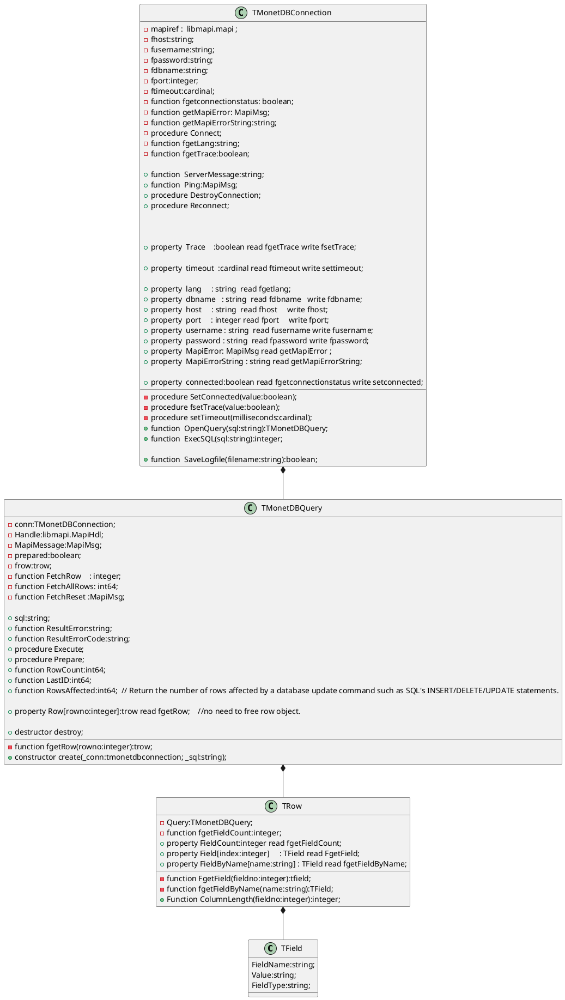

# ClassDiagram MonetDB Mapi driver for Delphi

```plantuml
scale 0.4

@startuml
skinparam linetype ortho


class "TField" 
{
    FieldName:string;
    Value:string;
    FieldType:string;
    }

class "TRow" 
{
  -Query:TMonetDBQuery;
  -function fgetFieldCount:integer;
  -function FgetField(fieldno:integer):tfield;
  -function fgetFieldByName(name:string):TField;
  +Function ColumnLength(fieldno:integer):integer;
  +property FieldCount:integer read fgetFieldCount;
  +property Field[index:integer]     : TField read FgetField;
  +property FieldByName[name:string] : TField read fgetFieldByName;
}

class "TMonetDBQuery" 
{
  -conn:TMonetDBConnection;
  -Handle:libmapi.MapiHdl;
  -MapiMessage:MapiMsg;
  -prepared:boolean;
  -frow:trow;
  -function fgetRow(rowno:integer):trow;
  -function FetchRow    : integer;
  -function FetchAllRows: int64;
  -function FetchReset :MapiMsg;

  +sql:string;
  +function ResultError:string;
  +function ResultErrorCode:string;
  +procedure Execute;
  +procedure Prepare;
  +function RowCount:int64;  
  +function LastID:int64;     
  +function RowsAffected:int64;  // Return the number of rows affected by a database update command such as SQL's INSERT/DELETE/UPDATE statements.

  +property Row[rowno:integer]:trow read fgetRow;    //no need to free row object.

  +constructor create(_conn:tmonetdbconnection; _sql:string);
  +destructor destroy;
 
}

class "TMonetDBConnection"
  {
     
       -mapiref :  libmapi.mapi ;
       -fhost:string;
       -fusername:string;
       -fpassword:string;
       -fdbname:string;
       -fport:integer;
       -ftimeout:cardinal;
       -function fgetconnectionstatus: boolean;
       -function getMapiError: MapiMsg;
       -function getMapiErrorString:string;
       -procedure Connect;
       -procedure SetConnected(value:boolean);
       -function fgetLang:string;
       -function fgetTrace:boolean;
       -procedure fsetTrace(value:boolean);
       -procedure setTimeout(milliseconds:cardinal);
     
       +function  ServerMessage:string;
       +function  Ping:MapiMsg;       
       +procedure DestroyConnection;  
       +procedure Reconnect;          

       +function  OpenQuery(sql:string):TMonetDBQuery;       
       +function  ExecSQL(sql:string):integer;  

       +function  SaveLogfile(filename:string):boolean;

       +property  Trace    :boolean read fgetTrace write fsetTrace;

       +property  timeout  :cardinal read ftimeout write settimeout;

       +property  lang     : string  read fgetlang;
       +property  dbname   : string  read fdbname   write fdbname;
       +property  host     : string  read fhost     write fhost;
       +property  port     : integer read fport     write fport;
       +property  username : string  read fusername write fusername;
       +property  password : string  read fpassword write fpassword;        
       +property  MapiError: MapiMsg read getMapiError ;
       +property  MapiErrorString : string read getMapiErrorString;

       +property  connected:boolean read fgetconnectionstatus write setconnected;
}

TMonetDBConnection *-- TMonetDBQuery
TMonetDBQuery *-- TRow
TRow *-- TField

```